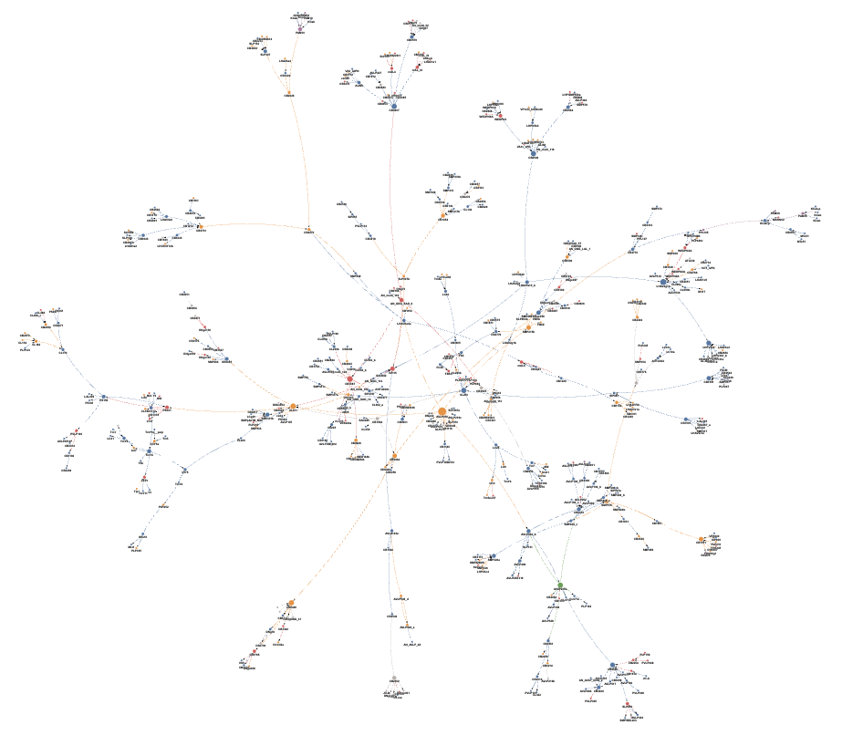
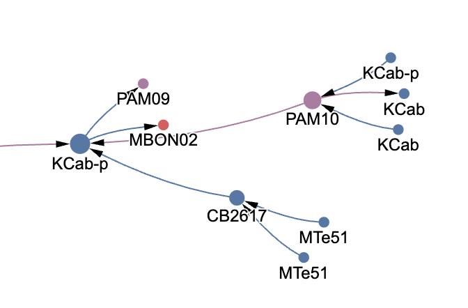
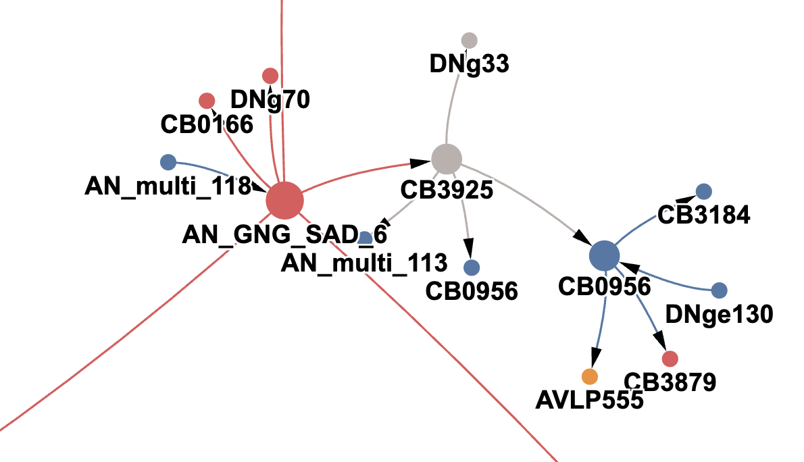
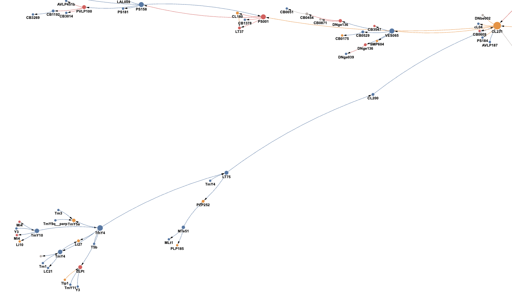

# Biological Analysis

This file details my understanding of the FAFB circuit, primarily from the metadata I downloaded from Codex and the cell type descriptions generated by Exodiac (Gemini pre-prompted with several FlyWire and *Drosophila* connectomics-related resources). I also briefly looked into literature as this was quite an interesting circuit.

## Choice of dataset

FAFB was the clear winner here. It is perhaps the the best annotated and most thoroughly reviewed connectome out of the three I picked for the technical aspect. Furthermore, I figured that isolating function in the brain would prevent the circuit from being too spread out across the CNS (MCNS) or too localized in one region (MAOL).

## The big takeaway

The discovered circuit, though quite large, still has a consistent theme. These neurons are almost all tied to **multimodal sensory integration**, in addition to memory encoding, descending neuron activity for downstream motor neurons, and even some probiscis activity. Due to the star-like shape of the circuit and the sheer number of nodes, I think it'll be more productive to talk about specific clusters that stood out to me as I explored the circuit.

## Visualizations

I opted to produce my own visualization of the network as I'm not able to query all 500 neurons in Codex at once. This also gave me more control in the information I was able to show. The image shows a screenshot of the render, but I highly encourage you to see the interactive version [here](https://ayush-shrivastava003.github.io/network), which shows root IDs, neurotransmitter types, and brief descriptions upon hovering on the nodes.

I still used Codex to render the 3D visualizations, but I only selected the highest-degree neurons in the network, or the neurons with the most functional importance:

[put image here]

## The AVLP030 Seed

The seed I selected ended up being an AVLP030 neuron, which is responsible for integrating auditory and visual signals. With the exception of one reciprocal edge, in this subgraph AVLP030 only forms outbound connections with its neighbors. It is glutmatergic, so depending on the receptors on its partners it may either be excitatory or inhibitory.

## Encoding senses into memory

The first subset that stood out to me was one small cluster at the edge of the graph with KCab and PAM cells. These are closely related cells that encode olfactory information into memories. The nearest Kenyon cell from the seed is four hops. The nearby CB2617 cell provides the large KCab-p cell with olfactory information, but oddly enough in this subgraph it is only connected to two tangential neurons carrying visual information.

## Ascending neurons lead to sensory integration circuits

I found a really interesting string of neurons that brings sensory signals from the nerve cord to neurons that process multiple senses. CB0956 leads to some other integrating neurons, but it also also has an incoming connection from a descending neuron.

## Excitatory visual input signals lead to inhibition of descending neurons

The bottom left cluster is several visual input neurons that get fed into excitatory integration neurons. It eventually reaches the large sensory integration neuron in the top right, which directly inhits a descending neuron and indirectly inhibits another descending neuron two hops away.

